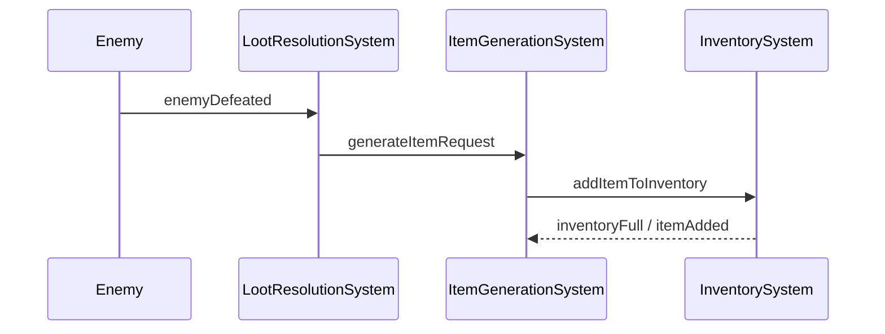
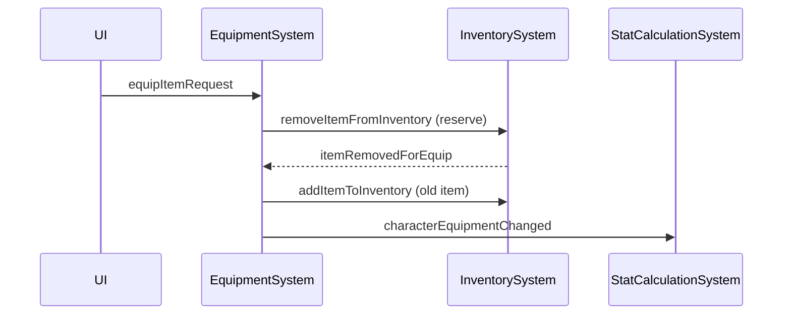

Domain Layer Architecture Overview

1. Core Philosophy

Before diving into the specifics, it's important to understand the guiding principles of this architecture.

    Data-Driven Design: The game's logic and behavior are driven by data (components) rather than hard-coded instructions. This allows for rapid content creation (in YAML files) without changing the core C# or C++ code.

    Decoupling via Events: Systems are highly decoupled and communicate reactively through a central EventBus. A system should not call methods on another system directly; it should emit an event and let other systems decide if they need to react. This prevents complex dependencies and makes systems easier to test and maintain.

    Single Responsibility Principle: Each system has one, clearly defined job (e.g., StatCalculationSystem only calculates stats, InventorySystem only manages inventory). This keeps the logic for any given feature contained and understandable.

2. Structure

The packages/domain directory contains all of the core game logic, completely independent of the UI or any specific game engine.

    /ecs: Contains the core building blocks of our Entity Component System architecture.

        /components: Holds all the raw data definitions. Each file here (e.g., character.ts, item.ts, quest.ts) defines the data structures (InfoData, QuestObjectiveData, etc.) that make up our entities.

        /entities: Defines the "blueprints" for our main game objects (Character, Item, Quest). These classes are primarily constructors that assemble a set of components into a logical entity.

        /systems: Contains all the "verbs" or logic of the game. These classes are where behavior is implemented. They operate on entities that possess specific components.

        EventBus.ts: The central nervous system of our architecture. It defines all possible events (EventMap) and allows for decoupled communication between systems.

3. Core Systems & Event Flow (Signals)

The systems are the engines that drive the game. They are designed to be reactive, listening for events on the EventBus and emitting new events as they complete their work.

Item & Inventory Systems

    LootResolutionSystem:

        Listens to: enemyDefeated.

        Emits: generateItemRequest.

        Description: Determines if a defeated enemy should drop loot based on loot tables. If so, it requests that a new item be generated.

    ItemGenerationSystem:

        Listens to: generateItemRequest.

        Emits: addItemToInventory.

        Description: The factory for creating all items. It takes a base item ID, potentially adds random affixes to determine rarity, and then passes the newly created item entity to the inventory system.

    InventorySystem:

        Listens to: addItemToInventory, removeItemFromInventory.

        Emits: inventoryFull, itemRemovedForEquip.

        Description: Manages adding and removing items from a character's bags. It handles logic for stacking items or finding empty slots.

    ConsumableSystem:

        Listens to: useConsumableRequest.

        Emits: removeItemFromInventory.

        Description: Applies the effects of consumable items (e.g., healing a character) and then requests the item's removal from inventory.

Character & Equipment Systems

    EquipmentSystem:

        Listens to: equipItemRequest, itemRemovedForEquip.

        Emits: removeItemFromInventory, addItemToInventory, characterEquipmentChanged.

        Description: Manages equipping and unequipping items. It works in a two-step process with the InventorySystem to ensure an item is successfully removed from a bag before being placed in an equipment slot.

    StatCalculationSystem:

        Listens to: characterEquipmentChanged.

        Emits: None.

        Description: The single source of truth for character stats. When notified of a change (like new equipment), it recalculates a character's derived stats based on their core stats, equipment, buffs, etc.

Quest Systems

    QuestLogSystem:

        Listens to: questAccepted, questTurnedIn.

        Emits: questProgressUpdated, questCompleted.

        Description: The central manager for a character's quests. It adds QuestStatusComponents to a character and updates them as they progress.

    QuestTrackingSystem:

        Listens to: enemyDefeated, itemPickedUp (and other general game events).

        Emits: None. (It calls a method on QuestLogSystem).

        Description: A purely reactive system that watches for game events and notifies the QuestLogSystem if a relevant objective's conditions are met.

    QuestRewardSystem:

        Listens to: questTurnedIn.

        Emits: generateItemRequest.

        Description: Distributes rewards (XP, gold, items) to a character when a quest is turned in.

    QuestStateSystem:

        Listens to: questAccepted, questCompleted, questTurnedIn.

        Emits: None.

        Description: Allows quests to affect the game world. It listens for quest status changes and can trigger actions like spawning or despawning entities.

4. Data Flow Diagrams

Include simple diagrams to make event-driven flows obvious. Use Mermaid when supported; add an ASCII fallback so the README remains useful in plain viewers.

Mermaid sequence (preferred):

ASCII fallback:
Enemy -> LootResolutionSystem : enemyDefeated
LootResolutionSystem -> ItemGenerationSystem : generateItemRequest
ItemGenerationSystem -> InventorySystem : addItemToInventory
InventorySystem -> ItemGenerationSystem : inventoryFull / itemAdded

Example: Equip flow

ASCII fallback:
UI -> EquipmentSystem : equipItemRequest
EquipmentSystem -> InventorySystem : removeItemFromInventory
InventorySystem -> EquipmentSystem : itemRemovedForEquip
EquipmentSystem -> StatCalculationSystem : characterEquipmentChanged

5. Key Entities & Their Core Components

A concise cheat-sheet for most-used entities and their critical components.

- Character
  - IdentityComponent (id, name, level)
  - StatsComponent (strength, dexterity, intelligence, hp, mp)
  - EquipmentComponent (slots map)
  - InventoryComponent (bags, slots)
  - QuestLogComponent (active/completed quests)

- Item
  - ItemInfoComponent (baseId, name, type, rarity)
  - StackableComponent (maxStack)
  - EquipableComponent (slot, statBonuses)
  - ConsumableComponent (effects, charges)

- Quest
  - QuestInfoComponent (id, title, description)
  - QuestObjectiveComponent (type, targetId, count)
  - QuestRewardComponent (xp, gold, itemIds)

6. Interaction with Other Layers

Define the boundary and rules for communication between domain and other layers (UI, presentation, engine).

- Principle: The EventBus is the only allowed channel crossing the boundary.
- Presentation/UI responsibilities:
  - Emit intent events (e.g., equipItemRequest, useConsumableRequest, questAcceptedRequest).
  - Subscribe to state-change events to update visuals (questProgressUpdated, characterEquipmentChanged, inventoryFull).
  - Do not call domain system methods directly.
- Domain responsibilities:
  - Own authoritative game state and business rules.
  - Expose events that represent state changes and requests.
  - Validate and sanitize input coming from presentation layer events.
- Example mappings:
  - UI -> Domain: equipItemRequest (user clicked "equip")
  - Domain -> UI: characterEquipmentChanged (update character sheet)
  - UI -> Domain: openInventoryRequest -> Domain emits current inventory snapshot event

Application Layer (or Orchestration / Use Cases)

- Purpose:
  - Acts as the thin orchestration layer between Presentation/UI and the Domain.
  - Coordinates use-cases (commands, transactions, composition) that involve multiple domain systems or external services.
  - Translates UI intents into domain-level events and interprets domain events into presentation-friendly responses.

- Responsibilities:
  - Validate and normalize user input (lightweight checks); defer business rules to Domain.
  - Orchestrate multi-step flows (e.g., equip sequence: reserve inventory slot, remove item, update equipment, recalc stats).
  - Coordinate persistence/transactions or interaction with infrastructure (save/load, external APIs) when necessary.
  - Emit domain intent events to the EventBus and subscribe to resulting domain events to determine outcome.
  - Provide a stable API for the presentation layer (commands or RPC) so the UI doesn't wire directly to many domain events.

- What it should NOT do:
  - Contain core business rules or complex domain logic.
  - Duplicate domain validation that belongs in domain services/systems.

- Example flow (option A — event-driven):
  - UI -> Application: send "EquipItemCommand" (HTTP/IPC/SDK)
  - Application: validate, then emit EventBus "equipItemRequest"
  - Domain systems react and emit "itemRemovedForEquip" / "characterEquipmentChanged"
  - Application may listen for finalizing events and respond to UI (ack/failure) or let UI subscribe directly.

- Where to place and test:
  - Recommended folder: /packages/application or /src/application (outside /packages/domain).
  - Unit-test orchestration logic; mock EventBus and external infra.
  - Keep services stateless where possible to simplify concurrency and retries.

7. How to Extend the Domain

A short checklist to add a new feature in the domain layer.

1. Add new Component(s)
   - Create data-only component(s) in /ecs/components describing the shape of the data.
2. Create or extend Entity blueprints
   - If this is a new concrete object (e.g., new item type), add/adjust an entity in /ecs/entities.
3. Implement a System
   - Add a System class in /ecs/systems that implements only the behavior related to the new component(s).
   - Keep responsibilities focused (SRP).
4. Define Events
   - Add any new events to EventBus.ts (EventMap). Keep names descriptive and intent-driven.
5. Wire Up Subscriptions
   - Subscribe the new System to the relevant events produced by other systems.
6. Add Tests
   - Unit-test the System in isolation by mocking EventBus and components.
7. Update Documentation & Diagrams
   - Add any new flows to Domain_Overview.md and update diagrams accordingly.
8. Data-Driven Content
   - If feature needs data, add YAML/JSON entries (e.g., new loot table entries, item base data).

Notes and links
- See /ecs for concrete component and system examples.
- Event naming guidance: prefer noun+action or intent (e.g., equipItemRequest, itemAddedToInventory, questProgressUpdated).
- Keep diagrams close to code to ease onboarding.